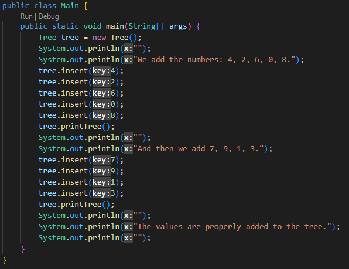
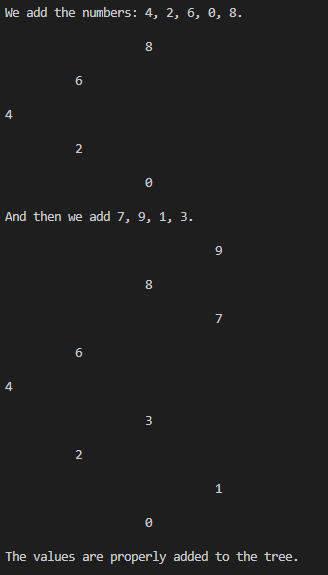

# BinarySearchTree

This is binary search tree implemented in Java without libraries.  
The Node class represents a single node in the tree, with a key value and pointers to left and right child nodes. 
The Tree class includes methods for insertion, search, and printing the tree in a vertical layout, 
Te insertion method maintains the binary search tree property for order, while the search method uses binary search for efficiency.
The Main class provides an example of how to use the Tree class to create a binary tree, insert nodes, and print the tree. 

## Screenshots  

In the example, the numbers 4, 2, 6, 0, and 8 are inserted into the tree, followed by 7, 9, 1, and 3. The resulting tree is properly ordered and contains all of the added values. Overall, the implementation provides a modular and efficient way to represent and manipulate binary trees in Java.  

  
  

