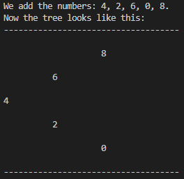
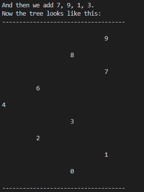

# BinarySearchTree

This is binary search tree implemented in Java without libraries. Consisting on 2 classes: Node and Tree. The Node class represents a single node in the tree, with a key value and pointers to left and right child nodes. The Tree class includes methods for insertion, search, and printing the tree in the console.  
The insertion method inserts into the tree in an orderly manner, maintaining the binary search tree property. Meanwhile, the search method utilizes binary search for efficiency. 

## Screenshots  

In the example, we first add the numbers 4, 2, 6, 0 and 8:

  
Followed by 7, 9, 1, and 3. 

The resulting tree is properly ordered and contains all of the added values.

